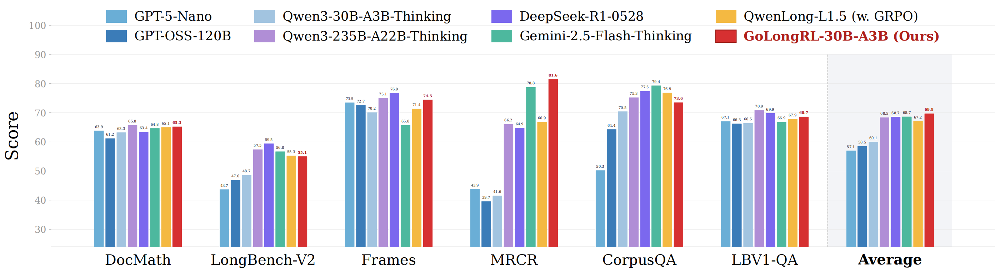
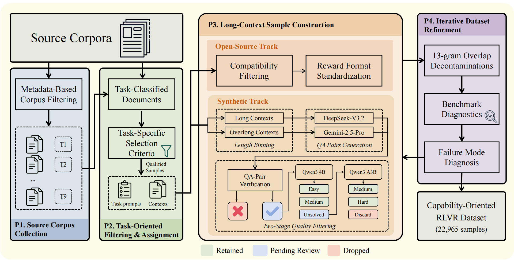

# 🎯 GoLongRL: Capability-Oriented Long Context Reinforcement Learning with Multitask Alignment

<div align="center">

[](https://arxiv.org/abs/2605.19577)
[](https://huggingface.co/papers/2605.19577)
[](https://huggingface.co/Kwai-Klear/GoLongRL-4B)
[](https://huggingface.co/Kwai-Klear/GoLongRL-30B-A3B)
[](https://huggingface.co/datasets/Kwai-Klear/GoLongRL)
[](mailto:xiao_xuan_zi_666@163.com)

</div>

## 📣 Latest News

**[May 19, 2026]**  📢 GoLongRL is available on [arXiv](https://arxiv.org/abs/2605.19577) and [HuggingFace Daily](https://huggingface.co/papers/2605.19577).

## 📌 Overview

We present **GoLongRL**, a fully open-source, capability-oriented post-training recipe for long-context reinforcement learning with verifiable rewards (RLVR). 

Existing long-context RL methods tend to focus data construction on retrieval-path complexity—multi-hop chains, UUID tracking, chunk-based QA—while collapsing diverse task objectives into a single binary reward. This leaves critical capabilities such as summarization, ranking, aggregation, and structured reasoning without direct training signal. GoLongRL addresses these limitations through two contributions.

GoLongRL addresses these limitations through two key contributions. **(1) Capability-oriented data construction**, a 23K-sample RLVR dataset spanning 9 task types with heterogeneous reward functions, and **(2) TMN-Reweight**, a multitask optimization method that combines task-level mean normalization for cross-task reward scale alignment with difficulty-adaptive reweighting for more reliable advantage estimation.

<div align="center">



<sub>Overall performance comparison on long-context benchmarks (DocMath, LongBench-V2, Frames, MRCR, CorpusQA, LBV1-QA).</sub>

</div>

**GoLongRL-30B-A3B** achieves long-context performance comparable to DeepSeek-R1-0528 and Qwen3-235B-A22B-Thinking-2507, while using a significantly smaller activated parameter budget.

| Model | Avg. | DocMath | LBV2 | Frames | MRCR | CorpusQA | LBV1-QA |
|---|---|---|---|---|---|---|---|
| DeepSeek-R1-0528 | 68.7 | 63.4 | 59.5 | 76.9 | 64.9 | 77.5 | 69.9 |
| Qwen3-235B-A22B-Thinking | 68.5 | 65.8 | 57.5 | 75.1 | 66.2 | 75.3 | 70.9 |
| Gemini-2.5-Flash-Thinking | 68.7 | 64.8 | 56.8 | 65.8 | 78.8 | 79.4 | 66.9 |
| QwenLong-L1.5 (w. GRPO) | 67.2 | 65.1 | 55.3 | 71.4 | 66.9 | 76.9 | 67.9 |
| **GoLongRL-30B-A3B (Ours)** | **69.8** | **65.3** | **55.1** | **74.5** | **81.6** | **73.6** | **68.7** |

Our framework combines the following.

1. **Capability-Oriented Dataset (23K samples, 9 task types).** Guided by a taxonomy of long-context capabilities, the dataset covers precise retrieval, comprehension, exhaustive retrieval, numerical reasoning, structured extraction, structured matching, graded ranking, sequence ordering, and summarization. Each task is paired with its natural evaluation metric (EM, Accuracy, F1, math_verify, IoU, SubEM, NDCG, Pairwise, ROUGE-L) as the reward function, rather than being collapsed into a single indicator.

2. **TMN-Reweight.** When training on heterogeneous reward types, per-prompt normalization in standard GRPO can mix up cross-task scale differences with prompt difficulty. TMN-Reweight is a simple modification that normalizes advantages at the task level instead of the prompt level, and adds a difficulty-adaptive weight to reduce noise from very easy or very hard prompts. It provides a modest but consistent improvement over vanilla GRPO in our ablations (+0.8 avg. at 4B scale), with gains mainly on aggregation-intensive benchmarks like CorpusQA.

3. **Full Open Release.** We publicly release the complete dataset, the four-phase construction pipeline, and all training code.

### Key Results

- Under the same vanilla GRPO setup, our dataset alone outperforms the closed-source QwenLong-L1.5 dataset at both 4B and 30B scales (+6.1 avg. at 4B, +2.6 avg. at 30B).
- TMN-Reweight further improves average performance to 63.0 at 4B scale, surpassing QwenLong-L1.5 with its specialized AEPO algorithm (59.4).
- General capabilities (MMLU-Pro, AIME24/25, GPQA) are preserved or improved, with substantial gains on dialogue memory (LongMemEval +13.6) and agentic memory benchmarks.

<div align="center">



<sub>Overview of the four-phase Capability-Oriented RLVR Dataset construction pipeline.</sub>

</div>

---

## 🧪 Training

Training is built on [verl](https://github.com/volcengine/verl) with two RL algorithms:

- **GRPO** — Standard Group Relative Policy Optimization with per-group advantage normalization.
- **TMN-GRPO** (Task-Mixed Normalization GRPO) — Normalizes advantages within **reward-type groups** rather than globally, preventing high-variance tasks from dominating gradients when training on a mixture of heterogeneous long-context tasks. Supports optional **difficulty reweighting** that up-weights hard prompts based on smoothed per-prompt pass rate.

Supported models: **Qwen3-4B**, **Qwen3-30B-A3B** (MoE). Training runs on 16 nodes × 8 GPUs with SGLang async serving.

### 📦 Training Data

The capability-oriented training set (23K samples, 9 task types) is publicly available:

**Dataset**: [Kwai-Klear/GoLongRL-23K](https://huggingface.co/datasets/Kwai-Klear/GoLongRL-23K)

For full setup, data format, hyperparameters, and monitoring details, see [Train/verl/README.md](Train/verl/README.md).

```bash
export LLM=/path/to/Qwen3-4B
export TRAIN_FILE=/path/to/train.jsonl
export TEST_FILE=/path/to/test.jsonl

bash examples/GoLongRL/qwen3-4B-grpo.sh           # GRPO baseline
bash examples/GoLongRL/qwen3-4B-tmn-reweight.sh   # TMN-GRPO + difficulty reweighting
```

---

## 🔍 Evaluation

Evaluation uses **QwenLong-Benchmarks**, covering three capability dimensions:

| Dimension | Benchmarks |
|-----------|-----------|
| **Long-Context** | LongBench-V2, MRCR (≤128K / 128K–512K / 512K–1M), Frames, LongBench QA, DocMath, CorpusQA (≤128K / ≤1M) |
| **General** | MMLU-Pro, AIME 2024/2025, GPQA-Diamond |
| **Memory** | BFCL-V4 (memory subset), LongMemEval |

Ultra-long evaluations (up to 1M tokens) use YaRN RoPE scaling. For full setup and per-benchmark instructions, see [Eval/QwenLong-Benchmarks/README.md](Eval/QwenLong-Benchmarks/README.md).

```bash
conda create -n evalscope python=3.10 && conda activate evalscope
pip install -e Eval/QwenLong-Benchmarks/evalscope && pip install vllm

export MODEL_PATH=/path/to/model
export MODEL_NAME=your-model-name
bash Eval/QwenLong-Benchmarks/evalscope/eval_mrcr.128K.sh
```

---

## 🤝 Citation

```
@misc{lv2026golongrlcapabilityorientedlongcontext,
      title={GoLongRL: Capability-Oriented Long Context Reinforcement Learning with Multitask Alignment}, 
      author={Minxuan Lv and Tiehua Mei and Tanlong Du and Junmin Chen and Zhenpeng Su and Ziyang Chen and Ziqi Wang and Zhennan Wu and Ruotong Pan and jian Liang and Ruiming Tang and Han Li},
      year={2026},
      eprint={2605.19577},
      archivePrefix={arXiv},
      primaryClass={cs.CL},
      url={https://arxiv.org/abs/2605.19577}, 
}
```
